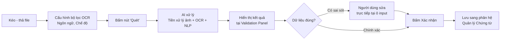

# TÀI LIỆU ĐẶC TẢ NGHIỆP VỤ: THỰC THI NHẬN DẠNG OCR

> **Mã tài liệu:** BA-OCR-02
> **Phiên bản:** 1.0
> **Phân hệ:** Nhận dạng & Bóc tách Chứng từ bằng AI OCR (OCR Execution & Validation)
> **Vai trò trong hệ thống:** Module Vận hành (Operation Layer) – Trung tâm số hóa chứng từ thực tế

---

## 1. Tổng quan phân hệ

### 1.1. Mục đích
Phân hệ **Thực thi Nhận dạng OCR** là **trái tim vận hành** của hệ thống – nơi diễn ra quá trình chuyển đổi chứng từ giấy/ảnh thành dữ liệu số có cấu trúc. Người dùng tải file chứng từ thực tế (hóa đơn, phiếu thu...) vào hệ thống, AI sẽ tự động đọc và bóc tách dữ liệu vào đúng các trường đã được khai báo trong [[Thiet_lap_Chung_tu_OCR]]. Sau đó, **con người sẽ đối chiếu, hiệu chỉnh** những điểm AI nhận diện chưa chính xác (cơ chế Human-in-the-loop).

> **Triết lý thiết kế:** "AI làm 80%, con người duyệt 20% – nhanh hơn nhập tay 10 lần, chính xác hơn AI hoàn toàn tự động."

### 1.2. Vai trò
- **Tăng tốc nhập liệu:** Từ trung bình 5-7 phút/hóa đơn nhập tay xuống còn 20-40 giây/hóa đơn.
- **Giảm sai sót con người:** AI nhận diện chính xác các trường số (Mã số thuế, Số tiền) – những chỗ thường xảy ra lỗi đánh máy.
- **Tạo dữ liệu sạch:** Đầu ra là dữ liệu có cấu trúc, sẵn sàng đẩy vào ERP/Kho dữ liệu.

### 1.3. Đối tượng sử dụng

| Vai trò | Quyền hạn | Tần suất sử dụng |
|---|---|---|
| **Nhân viên kế toán** | Tải file, quét, hiệu chỉnh, xác nhận | Cao – Hàng ngày |
| **Nhân viên nhập liệu** | Tải file, quét, hiệu chỉnh | Rất cao – Liên tục trong ngày |
| **Trưởng nhóm Kế toán** | Tất cả + Phê duyệt cuối | Trung bình – Cuối ca làm việc |

---

## 2. Quy trình tương tác người dùng (User Workflow)



### Diễn giải các bước:

| # | Bước | Mô tả nghiệp vụ chi tiết |
|---|---|---|
| 1 | **Kéo thả file** | Người dùng kéo-thả 1 hoặc nhiều file chứng từ vào vùng Drop Zone. Hỗ trợ cả nút `Browse` truyền thống. |
| 2 | **Cấu hình bộ lọc** | Chọn ngôn ngữ chính của chứng từ (VN/EN), chế độ OCR (Auto/Manual). Mặc định: `Tự động (AI)`. |
| 3 | **Bấm Quét** | Hệ thống kích hoạt pipeline: Tiền xử lý ảnh → OCR Engine → NLP trích xuất → Mapping vào schema. |
| 4 | **Đối chiếu kết quả** | Dữ liệu hiển thị tại 2 vùng: vùng Trường đơn (Header/Footer) và vùng Bảng chi tiết. |
| 5 | **Hiệu chỉnh** | Người dùng click vào ô có dữ liệu sai để sửa trực tiếp inline. Không cần mở popup. |
| 6 | **Xác nhận** | Bấm `Xác nhận` → chứng từ lưu sang phân hệ [[Quan_ly_Chung_tu_OCR]] với trạng thái `Nháp` hoặc `Đã xác nhận`. |

---

## 3. Đặc tả tính năng khu vực Tiếp nhận & Tối ưu hình ảnh (Input Panel)

### 3.1. Nghiệp vụ Kéo thả file (Drag & Drop)

| Đặc tả | Chi tiết |
|---|---|
| **Định dạng hỗ trợ** | `.PDF`, `.PNG`, `.JPG` / `.JPEG`, `.TIFF` / `.TIF`, `.DOCX` |
| **Dung lượng tối đa** | 25 MB/file, tối đa 20 file/lần upload (Bulk OCR) |
| **Số trang tối đa** | 50 trang/PDF |
| **Cơ chế** | Vùng Drop Zone có viền đứt nét, đổi màu khi hover. Hỗ trợ cả `Click to browse`. |
| **Preview** | Sau khi tải lên, hiển thị thumbnail ảnh/PDF ở phía bên trái màn hình. |

> **Quy tắc xử lý file lỗi:** Nếu file vượt dung lượng hoặc sai định dạng, hệ thống hiển thị Toast lỗi và **không thêm vào hàng đợi quét**.

### 3.2. Cài đặt nhận dạng (OCR Configuration)

| Tùy chọn | Giá trị | Mô tả nghiệp vụ |
|---|---|---|
| **Lọc Ngôn ngữ** | `Tiếng Việt`, `English`, `Đa ngôn ngữ` | Quyết định bộ từ điển AI sử dụng. Tiếng Việt tối ưu cho dấu thanh, English tối ưu cho ký tự Latin thuần. |
| **Chế độ OCR** | `Tự động (AI)` *(mặc định)*, `Thủ công (Tự chọn vùng)` | Auto: AI tự nhận diện toàn bộ. Manual: người dùng khoanh vùng cần quét. |
| **Loại chứng từ** | Dropdown chọn schema | Bắt buộc – Quyết định AI dùng template nào (lấy từ phân hệ [[Thiet_lap_Chung_tu_OCR]]). |

### 3.3. Cơ chế tăng cường chất lượng hình ảnh ngầm (Image Pre-processing Pipeline)

Trước khi đưa vào OCR Engine, ảnh được xử lý qua pipeline ngầm:

```
[1] Deskew (Cân chỉnh nghiêng)
    └→ Phát hiện góc nghiêng, xoay về 0°
[2] Denoise (Khử nhiễu)
    └→ Loại bỏ điểm ảnh nhiễu, vệt mờ
[3] Brightness/Contrast (Chỉnh sáng - tương phản)
    └→ Cân bằng histogram, làm rõ chữ
[4] Binarization (Nhị phân hóa)
    └→ Chuyển ảnh xám → đen trắng tuyệt đối, làm sắc nét đường nét chữ
[5] DPI Upscaling (Nâng độ phân giải)
    └→ Tăng DPI tối thiểu 300 nếu ảnh gốc thấp hơn
```

> **Lưu ý:** Toàn bộ pipeline diễn ra **ngầm trên server**, người dùng không cần biết hoặc tương tác. Mục tiêu duy nhất: nâng accuracy của OCR Engine lên trên 95%.

---

## 4. Đặc tả khu vực Duyệt kết quả (Validation Panel)

### 4.1. Hiển thị dữ liệu 7 trường đơn

Mỗi trường đơn được render thành **một ô input** kèm theo icon định vị (📍) chỉ đến vùng trên ảnh gốc:

| Thành phần | Mô tả |
|---|---|
| **Label trường** | Tên trường được lấy từ schema (VD: "Số hóa đơn") |
| **Ô Input** | Hiển thị giá trị AI bóc tách. Cho phép edit inline. |
| **Icon định vị 📍** | Click vào icon → ảnh gốc bên trái **highlight vùng nguồn (bounding box)** mà AI đã quét ra giá trị này. |
| **Indicator độ tin cậy** | Hiển thị màu sắc: 🟢 (>90% confidence), 🟡 (70-90%), 🔴 (<70%) – ưu tiên review trường đỏ. |

> **Ví dụ trực quan:** Người dùng click icon 📍 cạnh trường "Mã số thuế" → ảnh gốc highlight ô chứa MST ở góc trên trái → người dùng đối chiếu nhanh.

### 4.2. Cơ chế sửa đổi dữ liệu trực tiếp (Inline Edit)

| Đặc tả | Chi tiết |
|---|---|
| **Cơ chế** | Click vào ô input → chuyển sang chế độ Edit → gõ giá trị mới → bỏ focus (blur) hoặc Enter để lưu tạm. |
| **Validation realtime** | Khi sửa, hệ thống áp dụng quy tắc ép kiểu và validate (VD: MST chỉ cho số/gạch ngang). |
| **Highlight thay đổi** | Ô đã sửa được tô màu nền vàng nhạt để Quản lý biết trường nào do AI nhận, trường nào do người sửa. |
| **Undo** | Hỗ trợ `Ctrl + Z` để hoàn tác sửa đổi gần nhất. |

### 4.3. Quản lý bảng chi tiết sản phẩm (Line-items Management)

> Đây là vùng phức tạp nhất – nơi AI thường gặp khó khăn với hóa đơn nhiều dòng, dòng dài, hoặc bảng bị vỡ format.

#### 4.3.1. Cơ chế AI tự đổ dòng (Auto-fill rows)
- AI nhận diện cấu trúc bảng (table detection) → tự động sinh đủ số dòng tương ứng với số mặt hàng trên hóa đơn.
- Mỗi dòng được map đầy đủ vào 6 cột (STT, Tên hàng, ĐVT, Số lượng, Đơn giá, Thành tiền).

#### 4.3.2. Tính năng nghiệp vụ dự phòng `+ Thêm dòng` (Manual Row Insertion)
| Tình huống | Hành động |
|---|---|
| AI bỏ sót dòng (VD: dòng cuối bị mờ) | Người dùng bấm `+ Thêm dòng` → một dòng trống được thêm cuối bảng → nhập tay 6 cột. |
| Dòng AI nhận dư | Click icon `🗑️` cuối dòng để xóa dòng. |
| Cần chèn dòng giữa | Hover vào dòng cần chèn → menu `Chèn dòng phía trên/dưới`. |
| Cần copy dòng | Hỗ trợ duplicate dòng (chép giá trị) để giảm thời gian nhập. |

#### 4.3.3. Tự động tính lại (Auto-recalculation)
Khi người dùng sửa cột `Số lượng` hoặc `Đơn giá`, cột `Thành tiền` **tự động tính lại** = Số lượng × Đơn giá.

---

## 5. Trạng thái sau xử lý (Output Status)

### 5.1. Cơ chế chuyển đổi dữ liệu

```
[INPUT]                  [PROCESSING]                    [OUTPUT]
Ảnh thô / PDF    →    AI OCR + NLP + Validation    →   Dữ liệu JSON có cấu trúc
(file binary)        (pixel → ký tự → trường)         (sẵn sàng cho DB)
```

### 5.2. Các trạng thái có thể xảy ra sau khi bấm `Xác nhận`

| Trạng thái | Điều kiện chuyển trạng thái | Ý nghĩa nghiệp vụ |
|---|---|---|
| **🟡 Nháp (Draft)** | Lưu lần đầu, chưa xác nhận hoặc còn cảnh báo logic | Chứng từ vẫn cho phép sửa/xóa trong [[Quan_ly_Chung_tu_OCR]] |
| **🟢 Đã xác nhận (Confirmed)** | Người dùng bấm `Xác nhận` + tất cả ràng buộc logic số học hợp lệ | Khóa Sửa/Xóa, sẵn sàng cho bước tích hợp tiếp theo |
| **🔴 Lỗi (Error)** | Có ít nhất 1 trường bắt buộc rỗng hoặc sai logic số học không thể bỏ qua | Không cho phép xác nhận – yêu cầu sửa trước |

### 5.3. Dữ liệu được chuẩn hóa trước khi lưu

> Theo quy tắc đã định nghĩa tại [[Thiet_lap_Chung_tu_OCR]] mục 5 (Post-processing):
> - Tự động `trim()` khoảng trắng.
> - Ép kiểu `Currency` về số nguyên VND.
> - Chuẩn hóa định dạng ngày về `dd/MM/yyyy`.
> - Validate ràng buộc: `Tổng tiền hàng + Thuế VAT = Tổng thanh toán`.

### 5.4. Kết quả cuối cùng
Sau khi `Xác nhận`, một **bản ghi chứng từ hoàn chỉnh** được tạo ra với cấu trúc:

```json
{
  "documentId": "DOC-20260520-001",
  "schemaCode": "INVOICE-VAT",
  "status": "Confirmed",
  "header": {
    "invoiceNumber": "0001234",
    "issueDate": "20/05/2026",
    "sellerTaxCode": "0312345678",
    "sellerName": "Công ty TNHH ABC"
  },
  "footer": {
    "totalAmount": 10000000,
    "vatAmount": 1000000,
    "grandTotal": 11000000
  },
  "lineItems": [
    {
      "stt": 1,
      "name": "Bàn phím cơ",
      "unit": "Cái",
      "quantity": 2,
      "unitPrice": 5000000,
      "amount": 10000000
    }
  ],
  "ocrConfidence": 0.96,
  "createdBy": "user@company.com",
  "createdAt": "2026-05-20T10:30:00Z"
}
```

Bản ghi này sẽ xuất hiện tại phân hệ [[Quan_ly_Chung_tu_OCR]] để tiếp tục vòng đời.

---

> 📌 **Tài liệu liên quan:**
> - [[Thiet_lap_Chung_tu_OCR]] – Cung cấp schema cho phân hệ này hoạt động.
> - [[Quan_ly_Chung_tu_OCR]] – Nơi tiếp nhận chứng từ sau khi xác nhận.
