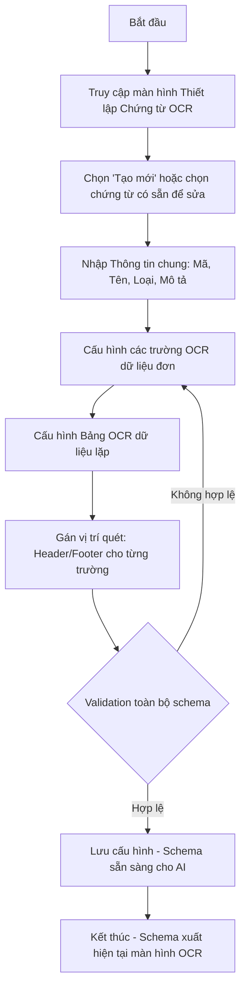

# TÀI LIỆU ĐẶC TẢ NGHIỆP VỤ: THIẾT LẬP CHỨNG TỪ OCR

> **Mã tài liệu:** BA-OCR-01
> **Phiên bản:** 2.0
> **Phân hệ:** Thiết lập Chứng từ OCR (Document Schema Configuration)
> **Vai trò trong hệ thống:** Module nền tảng (Foundation Layer) – Cấu hình bộ khung dữ liệu cho AI Engine
> **Service xử lý:** OCR Service (`apps/ocr-service`) – NestJS + gRPC
> **Database:** OCR_DB (`packages/ocr-db`) – kết nối qua `OCR_DATABASE_URL` (port `5433`)
> **Giao tiếp:** Client → API Gateway (REST) → OCR Service (gRPC port `50052`)

---

## 1. Tổng quan phân hệ

### 1.1. Mục đích
Phân hệ **Thiết lập Chứng từ OCR** là điểm khởi đầu (entry point) của toàn bộ luồng số hóa chứng từ. Đây là nơi người quản trị **định nghĩa "bộ khung" (Schema/Template)** cho từng loại chứng từ mà hệ thống AI cần phải nhận diện. Mỗi cấu hình lưu tại đây sẽ trở thành "kim chỉ nam" cho mô hình AI/OCR ở [[Nhan_dang_Chung_tu_OCR]] biết cần trích xuất những trường dữ liệu nào, kiểu dữ liệu ra sao và phải đặt chúng vào vị trí nào trong bảng dữ liệu đầu ra.

> **Lưu ý nghiệp vụ:** Không có bước thiết lập này, AI không thể biết "Số hóa đơn" trông như thế nào, nằm ở đâu, hay phải trả về dạng `Text` hay `Number`. Phân hệ này quyết định chất lượng (precision) của toàn bộ luồng OCR phía sau.

### 1.2. Vai trò
- **Chuẩn hóa dữ liệu đầu ra:** Đảm bảo mọi chứng từ cùng loại đều có cùng một cấu trúc trường (field structure) thống nhất.
- **Dẫn hướng AI Engine:** Cung cấp metadata (tên trường, kiểu dữ liệu, vị trí Header/Footer) để AI tối ưu vùng quét.
- **Tăng tốc độ triển khai:** Khi cần hỗ trợ thêm một loại chứng từ mới (Phiếu thu, Hợp đồng, Bảng kê...), chỉ cần tạo schema mới mà không cần đào tạo lại model.

### 1.3. Đối tượng sử dụng

| Vai trò | Quyền hạn | Tần suất sử dụng |
|---|---|---|
| **Admin hệ thống** | Toàn quyền (Tạo/Sửa/Xóa/Kích hoạt schema) | Thấp – Khi onboarding hoặc bổ sung loại chứng từ mới |
| **Kỹ sư triển khai (BA/IT Implementer)** | Cấu hình, tinh chỉnh trường dữ liệu | Trung bình – Trong giai đoạn fine-tuning |
| **Nhân viên nghiệp vụ** | Chỉ xem (View-only) | Tham khảo |

---

## 2. Luồng xử lý nghiệp vụ (Workflow)



### Diễn giải các bước:
1. **Bước 1 – Khởi tạo:** Người dùng chọn `+ Tạo mới` để tạo schema chứng từ.
2. **Bước 2 – Khai báo thông tin chung:** Điền các thông tin định danh (Mã chứng từ, Tên, Loại, Mô tả).
3. **Bước 3 – Định nghĩa trường đơn (Single Fields):** Khai báo 7 trường dữ liệu cấp Header/Footer của hóa đơn.
4. **Bước 4 – Định nghĩa bảng lặp (Repeating Table):** Khai báo cấu trúc bảng "Chi tiết hàng hóa" gồm 6 cột.
5. **Bước 5 – Gán vị trí quét:** Đánh dấu mỗi trường thuộc vùng **Header** (đầu trang) hay **Footer** (cuối trang) để AI ưu tiên quét đúng vùng.
6. **Bước 6 – Kiểm tra & Lưu:** Hệ thống kiểm tra ràng buộc (mã duy nhất, ít nhất 1 trường bắt buộc...) → `Lưu cấu hình`.

---

## 3. Đặc tả chi tiết các trường dữ liệu đầu vào (Data Fields Specifications)

### 3.1. Phần Thông tin chứng từ (Document Metadata)

| Tên trường | Thành phần giao diện | Kiểu dữ liệu | Quy tắc nghiệp vụ / Điều kiện ràng buộc |
|---|---|---|---|
| **Mã chứng từ** | Textbox | `String(50)` | Bắt buộc nhập. Duy nhất toàn hệ thống. Cho phép `A-Z`, `0-9`, dấu `_` và `-`. Không chấp nhận khoảng trắng và ký tự đặc biệt. |
| **Tên chứng từ** | Textbox | `String(255)` | Bắt buộc nhập. Tên thân thiện với người dùng (VD: "Hóa đơn GTGT đầu vào"). |
| **Loại chứng từ** | Dropdown (Select) | `Enum` | Bắt buộc chọn. Danh mục cố định: `Hóa đơn`, `Phiếu thu`, `Phiếu chi`, `Hợp đồng`, `Bảng kê`... |
| **Mô tả** | Textarea | `String(1000)` | Không bắt buộc. Ghi chú nghiệp vụ về phạm vi sử dụng của schema. |

### 3.2. Phần Trường OCR dữ liệu đơn (7 trường Single Fields)

> Đây là các trường xuất hiện **một lần duy nhất** trên một chứng từ, thường nằm ở vùng tiêu đề (Header) hoặc tổng kết (Footer).

| # | Tên trường | Thành phần giao diện | Kiểu dữ liệu | Vị trí quét | Quy tắc nghiệp vụ / Ràng buộc |
|---|---|---|---|---|---|
| 1 | **Số hóa đơn** | Textbox | `Text` | `Header` | Bắt buộc. **Duy nhất** trong hệ thống (chống trùng lặp khi nhập liệu). Tối đa 20 ký tự. |
| 2 | **Ngày phát hành** | DatePicker | `Date (dd/MM/yyyy)` | `Header` | Bắt buộc. Không lớn hơn ngày hiện tại (`<= today`). AI tự chuẩn hóa định dạng `dd/MM/yyyy`. |
| 3 | **Mã số thuế người bán** | Textbox | `Text` | `Header` | Bắt buộc. **Chỉ chấp nhận chữ số (`0-9`) và dấu gạch ngang (`-`)**. Độ dài 10 hoặc 13 ký tự (chuẩn MST Việt Nam). |
| 4 | **Tên người bán** | Textbox | `Text` | `Header` | Bắt buộc. Tối đa 255 ký tự. Hỗ trợ Unicode tiếng Việt có dấu. |
| 5 | **Tổng tiền hàng** | Textbox (Numeric) | `Currency (VND)` | `Footer` | Bắt buộc. Định dạng số tiền có dấu phân cách hàng nghìn. `>= 0`. |
| 6 | **Tiền thuế VAT** | Textbox (Numeric) | `Currency (VND)` | `Footer` | Bắt buộc. `>= 0`. Hỗ trợ thuế suất 0%, 5%, 8%, 10%. |
| 7 | **Tổng thanh toán** | Textbox (Numeric) | `Currency (VND)` | `Footer` | Bắt buộc. Phải tuân thủ ràng buộc: `Tổng tiền hàng + Tiền thuế VAT = Tổng thanh toán` (xem mục 5). |

### 3.3. Phần Bảng OCR dữ liệu lặp (Repeating Table)

> Bảng "**Chi tiết hàng hóa dịch vụ**" là vùng dữ liệu lặp lại nhiều dòng, mỗi dòng tương ứng một mặt hàng/dịch vụ trên hóa đơn.

| # | Tên cột | Thành phần giao diện | Kiểu dữ liệu | Quy tắc nghiệp vụ |
|---|---|---|---|---|
| 1 | **STT** | Textbox (Numeric) | `Number (Integer)` | Tự động tăng dần (1, 2, 3...). Không cho phép trùng. |
| 2 | **Tên hàng hóa/dịch vụ** | Textbox | `Text` | Bắt buộc. Tối đa 500 ký tự. Hỗ trợ Unicode tiếng Việt. |
| 3 | **ĐVT (Đơn vị tính)** | Textbox | `Text` | Không bắt buộc. Tối đa 50 ký tự (VD: `Cái`, `Kg`, `Hộp`, `Lít`). |
| 4 | **Số lượng** | Textbox (Numeric) | `Number (Decimal)` | Bắt buộc. `> 0`. Hỗ trợ tối đa 4 chữ số thập phân. |
| 5 | **Đơn giá** | Textbox (Numeric) | `Number (Decimal)` | Bắt buộc. `>= 0`. Hỗ trợ định dạng tiền tệ Việt Nam. |
| 6 | **Thành tiền** | Textbox (Numeric) | `Number (Decimal)` | Bắt buộc. **Ràng buộc nghiệp vụ:** `Thành tiền = Số lượng × Đơn giá` (sai số làm tròn ≤ 1 đồng). |

---

## 4. Các tính năng cốt lõi (Core Functions)

### 4.1. Tính năng thêm/sửa/xóa trường dữ liệu động (Dynamic Field Management)

| Tính năng | Mô tả nghiệp vụ |
|---|---|
| **➕ Thêm trường** | Người dùng bấm nút `+ Thêm trường` để mở popup khai báo trường mới (Tên trường, Kiểu dữ liệu, Vị trí). |
| **✏️ Sửa trường** | Click vào trường đã có → mở form chỉnh sửa. Cảnh báo nếu schema đã được sử dụng để tránh phá vỡ dữ liệu cũ. |
| **🗑️ Xóa trường** | Cho phép xóa các trường tùy chỉnh. Các trường mặc định của hệ thống (7 trường chuẩn) **không cho phép xóa** mà chỉ ẩn/hiện. |
| **↕️ Sắp xếp thứ tự** | Hỗ trợ kéo-thả (drag & drop) để sắp xếp thứ tự trường hiển thị trên giao diện OCR. |

### 4.2. Tính năng cấu hình vị trí quét (Scan Zone Configuration)

Đây là tính năng **đặc thù** của hệ thống OCR, giúp AI **giảm vùng tìm kiếm** và tăng độ chính xác.

| Vị trí | Định nghĩa | Trường áp dụng tiêu biểu |
|---|---|---|
| **Header** | Vùng phía trên cùng của chứng từ (1/3 đầu trang) | Số hóa đơn, Ngày phát hành, Mã số thuế, Tên người bán |
| **Footer** | Vùng phía dưới cùng của chứng từ (1/3 cuối trang) | Tổng tiền hàng, Tiền thuế, Tổng thanh toán |
| **Body** *(mở rộng)* | Vùng giữa, dành cho bảng lặp | Chi tiết hàng hóa dịch vụ |

> **Lợi ích kỹ thuật:** Khi AI biết "Số hóa đơn" luôn ở vùng Header, nó sẽ ưu tiên ROI (Region of Interest) ở phần trên → giảm nhiễu, tăng tốc độ và độ chính xác.

---

## 5. Quy tắc Hậu xử lý ngầm (Post-processing & Validation Rules)

Sau khi AI quét xong, hệ thống áp dụng các quy tắc ngầm sau đây trước khi trả kết quả về cho người dùng:

### 5.1. Quy tắc ép kiểu dữ liệu (Type Casting Rules)

| Kiểu khai báo | Hành động ép kiểu |
|---|---|
| `Date` | Tự nhận diện các định dạng `dd/MM/yyyy`, `dd-MM-yyyy`, `yyyy/MM/dd` → chuẩn hóa về `dd/MM/yyyy`. |
| `Currency` | Loại bỏ ký hiệu tiền tệ (`đ`, `VND`, `$`), loại bỏ dấu phân cách hàng nghìn (`,` hoặc `.`), chuyển về số nguyên (đơn vị VND). |
| `Number` | Loại bỏ ký tự không phải số. Chuyển dấu thập phân về chuẩn `.`. |
| `Text` | Loại bỏ khoảng trắng dư thừa đầu/cuối (`trim()`). Giữ nguyên Unicode tiếng Việt. |

### 5.2. Ràng buộc Logic Số học (Arithmetic Validation – Bắt buộc)

```
[1] Tổng tiền hàng + Tiền thuế VAT = Tổng thanh toán
[2] Σ(Thành tiền của các dòng) = Tổng tiền hàng
[3] Thành tiền (mỗi dòng) = Số lượng × Đơn giá
```

> **⚠️ Cảnh báo:** Nếu một trong 3 ràng buộc trên không thỏa mãn (sai số > 1 đồng), hệ thống sẽ:
> - **Hiển thị cảnh báo màu vàng** tại các trường liên quan.
> - **Yêu cầu người dùng xác nhận thủ công** trước khi cho phép chuyển sang trạng thái `Đã xác nhận`.

### 5.3. Quy tắc bảo toàn schema
- Khi schema đã được dùng để quét ít nhất 1 chứng từ thực tế, hệ thống chỉ cho phép **thêm trường mới** (Additive Change), **không cho phép xóa hoặc đổi kiểu** các trường cũ → đảm bảo backward compatibility với dữ liệu đã lưu trữ.

### 5.4. Luồng dữ liệu trong kiến trúc Microservices

Schema được quản lý hoàn toàn trong **OCR Service** và lưu trong `OCR_DB`. Các service khác không được truy cập trực tiếp vào `OCR_DB`:

```
Web Portal (Next.js)
       │ REST
       ▼
API Gateway  ──── JWT Verification ──── Rate Limiting
       │ gRPC (port 50052)
       ▼
OCR Service (apps/ocr-service)
       │ Prisma ORM
       ▼
OCR_DB – packages/ocr-db (PostgreSQL 16, port 5433)
   └── document_schemas / document_fields / document_tables / document_table_columns
```

---

> 📌 **Tài liệu liên quan:**
> - [[OCR/Nhan_dang_Chung_tu_OCR]] – Màn hình vận hành OCR sử dụng schema này.
> - [[OCR/Quan_ly_Chung_tu_OCR]] – Lưu trữ và phê duyệt chứng từ sau khi đã OCR.
> - [[OCR/Database_Design_OCR_System]] – Thiết kế database chi tiết cho OCR_DB.
> - [[Tech_Stack_Architecture]] – Kiến trúc tổng thể hệ thống Monorepo.
